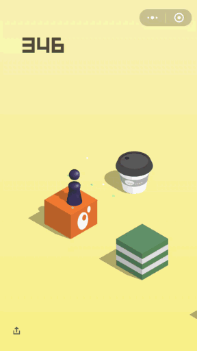
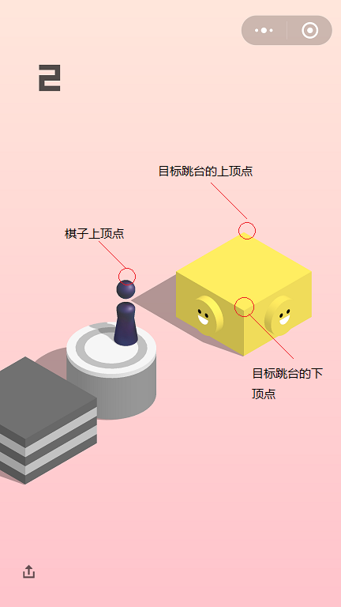

# 微信跳一跳辅助插件（纯Android原生实现）

####  微信跳一跳也出来一段时间了，各种插件版本也是层出不穷，基于学习的目的，写了这个demo，完全是android原生实现
目前的辅助程序大致原理都是一样的，只是实现方式不同。

#### 运行效果

#### 原理
    1.截取当前屏幕
    2.根据图片确定几个关键坐标点的位置(如下图所示)
    3.计算棋子底部和下一个直线跳台的距离
    4.根据距离模拟触摸屏幕

一开打算使用AccessibilityService来实现（比如之前比较火热的抢红包插件），因为不需用root系统，但是后来在截取屏幕的时候发现不太好实现，就放弃了。
后来选择使用adb shell命令来截屏和模拟点击，但是可惜的是需要root，所以只能root手机了（魅族自带root功能，非常方便）。
root之后一切就好办了，直接用service就能实现我们想要的功能了。

#### 思路
    1.启动一个服务
    2.在服务里重复执行：截屏——计算——点击屏幕的操作就行了

#### 注意点
    1.确保服务不会轻易被系统杀死，这边我用了前台服务（优先级稍高于后台服务）
    2.图片的扫描是bitmap对象，这边注意bitmap的内存回收

#### 关键代码

截屏和模拟点击

    获取了root权限后：
    主要是两条指令：
    screencap -p /sdcard/跳一跳助手/wxjump.png"//截屏
    input swipe 100 100 100 100 100//触摸屏幕

本地图像识别确定关键坐标点

    首先扫描确定目标跳台的上顶点，因为微信跳一跳的背景几乎都为纯色背景，
    可以通过逐行扫描，根据颜色差来确定上顶点。
    这边不需要扫描全部图片，跳台的高度基本在屏幕的上半部分，可以扫描（1/3——2/3或者2/5——3/5）
    大概差不多就行，可以自行调整。

    Bitmap src =  BitmapFactory.decodeFile("/sdcard/跳一跳助手/wxjump.png");//获取本地图像
    int  R, G, B;
            int pixelColor;
            int pixelColorTop=0;//台面上顶点颜色
            int pixelBottomColor=0;//台面下顶点颜色
            int height = src.getHeight();
            int width = src.getWidth();
            Point chessPoint=new Point();//棋子坐标点
            Point tableTopPoint=new Point();//目标跳台上顶点
            Point tableMiddlePoint=new Point();//目标跳台中心点
            Point tableBottomPoint=new Point();//目标跳台下顶点
            //寻找跳台上顶点
            searchTop:
            for (int y = height/4; y < 2*height/3; y++) {
                int pixelColorBorder=src.getPixel(50, y);//边界对照颜色
                int R_BORDER= Color.red(pixelColorBorder);
                int G_BORDER= Color.green(pixelColorBorder);
                int B_BORDER= Color.blue(pixelColorBorder);
                for (int x = 50; x < width-50; x++) {
                    pixelColor = src.getPixel(x, y);
                    R = Color.red(pixelColor);
                    G = Color.green(pixelColor);
                    B = Color.blue(pixelColor);
                    //根据颜色值差异判断上顶点
                    if(Math.abs(R_BORDER-R)>10||Math.abs(G_BORDER-G)>10||Math.abs(B_BORDER-B)>10){
                        pixelColorTop=pixelColor;
                        tableTopPoint.x=x;
                        tableTopPoint.y=y;
                        Log.e("tableTopPointColor:","("+R+"|"+G+"|"+B+")");
                        break searchTop;
                    }

                }
            }

    逐行扫描，首先是获取边界对照点的颜色值，然后逐一比对。我看过其他的一些版本，有些是根据只要颜色值不同
    就默认为是上顶点。但是实际提取颜色的过程中，我发现同一行每一个像素点背景的颜色存在细小的误差，比如两个相邻点
    的颜色值可能是RGB[255，255，255]和[254,254,255]。
    所以我这边判断上顶点是根据检测点与边界对照点RGB的误差超过10就可以认为是上顶点。（目前测试没有发现问题）

    //寻找棋子坐标点
            searchChess:
            for(int y=tableTopPoint.y;y<2*height/3; y++){
                for (int x = 50; x < width-50; x++) {
                    pixelColor = src.getPixel(x, y);
                    R = Color.red(pixelColor);
                    G = Color.green(pixelColor);
                    B = Color.blue(pixelColor);
                    //根据颜色值判断棋子上定顶点
                    if(50 < R&&R< 60&&53 < G &&G< 63&&95 < B&&B< 110){
                        chessPoint.x=x;
                        chessPoint.y=y+130;
                        Log.e("chess:",chessPoint.x+"|"+chessPoint.y);
                        Log.e("chess:",R+"|"+G+"|"+B);
                        break searchChess;
                    }
                }
            }

    棋子的坐标点相对好找，这边为了节省扫描开支，y轴可以从跳台的上顶点往下扫描
    直接判定颜色值得RGB范围即可确定。和其他版本不同的是，我这边只扫描了棋子的上顶点。因为
    棋子的大小是固定的，确定了上顶点就可以确定棋子跳台的中心位置了。我这边默认加了130（可能有一些误差，实际测试暂时没发现问题）

    //寻找跳台下顶点,从最大方块往上计算，寻找与上顶点相同的点
            for(int y=tableTopPoint.y+274;y>tableTopPoint.y; y--){
                pixelBottomColor = src.getPixel(tableTopPoint.x, y);
                if(pixelBottomColor==pixelColorTop){
                    tableBottomPoint.x=tableTopPoint.x;
                    tableBottomPoint.y=y;
                    tableMiddlePoint.x=tableBottomPoint.x;
                    tableMiddlePoint.y=(tableBottomPoint.y+tableTopPoint.y)/2;
                    Log.e("bottom:",tableTopPoint.x+"|"+y);
                    Log.e("middle:",tableMiddlePoint.x+"|"+tableMiddlePoint.y);
                    break;
                }

            }

    这边也是其他版本提供的思路，获取到上顶点后，因为跳一跳跳台的大小不会超过某一个值，所以直接从上顶点的y
    坐标加274往上扫描，颜色值与上顶点相同的点就是下顶点。这里的274大约是最大方块的对角线长度。

计算距离s；确定触摸时间t

因为距离和触摸时间是一个一次函数t=k*s，所以只需要确定k的值就行

     float SpaceTimeConfig=0.92f;
            Log.e("distance",(int)(SpaceTimeConfig*distance)+"");
            try {
                CommandExecution.execCommand("input swipe 100 100 100 100 "+(int)(SpaceTimeConfig*distance),true);
            } catch (Exception e) {
                e.printStackTrace();
                Log.e("error",e.getMessage()+"");
            }
     我这边k的值取得0.92 （测试后，每次都跳的中心点）这个值试几次就可以调出来，当然你也可以自己计算出
     不同的分辨率的屏幕需要调整一下

#### 其他优化待优化的地方
     1.图像识别的地方还可以优化，主要是跳台的上下顶点位置，某些特殊的纹路会识别失败（木纹之类的）
     2.代码里的一些常量（k的系数，棋子高度，跳台的最大面宽等），也不需要手动替换，可以获取屏幕的分辨率来做适配
     3.读取本地图像的权限问题，我没有做适配，因为测试用的魅族手机，6.0以上的权限不需要特别适配，如果是其他手机还要增加读取权限。
